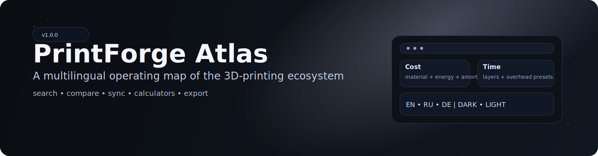

# PrintForge Atlas



[](https://creativecommons.org/publicdomain/zero/1.0/)
[](https://pages.github.com/)
[](#quality-gates)

PrintForge Atlas is a production-grade static web application that turns the 3D-printing ecosystem into a multilingual, searchable, and operationally useful knowledge atlas.

## Product Scope

- Multilingual interface: `EN`, `RU`, `DE`
- Fast navigation across ecosystem sections
- Filtering by section, tag, level, and printer type
- Compare mode, favorites, and history workflows
- Sync from upstream curated source
- Advanced print calculators (cost/time with presets and breakdowns)
- Export workflows (JSON, Markdown, PDF/Print)
- Light/Dark theming with custom cinematic transition system

## Quality Gates

Run before release:

```powershell
node scripts/validate_resources.js
node tests/smoke.test.js
python scripts/build_release.py
```

Expected output:

- `resources validation passed`
- `smoke tests passed`
- `dist build complete`

## Deployment

Deployment is configured via GitHub Actions:

- workflow: `.github/workflows/deploy-pages.yml`
- publish source: `./dist`
- target: GitHub Pages

Required repository settings:

1. `Settings -> Pages -> Source: GitHub Actions`
2. `Settings -> Actions -> Workflow permissions: Read and write`

## Upstream Attribution

Primary source dataset:

- Project: [`ad-si/awesome-3d-printing`](https://github.com/ad-si/awesome-3d-printing)
- Author: `ad-si`
- License: `CC0 1.0 Universal`
- License URL: <https://creativecommons.org/publicdomain/zero/1.0/>

Reference standard:

- Awesome list ecosystem by Sindre Sorhus: <https://github.com/sindresorhus/awesome>

## License

This project is licensed under **CC0 1.0 Universal**.
See [`LICENSE`](./LICENSE).
